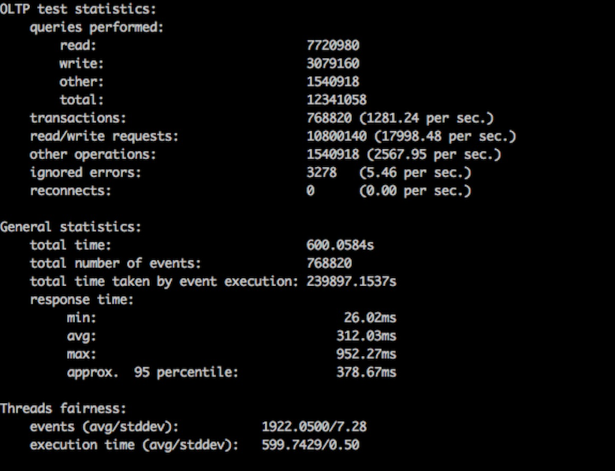
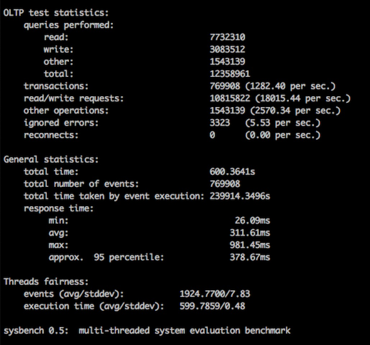
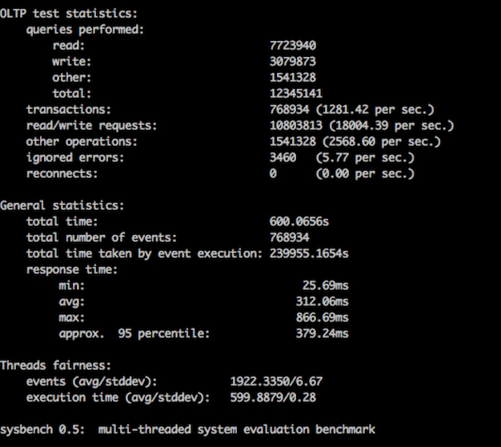
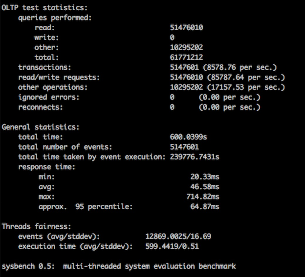
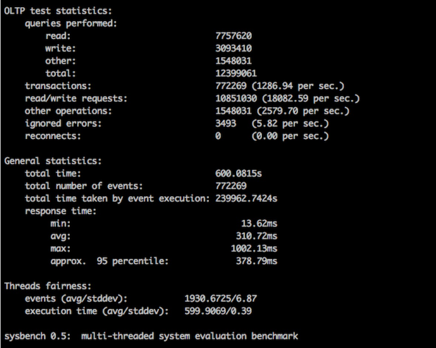
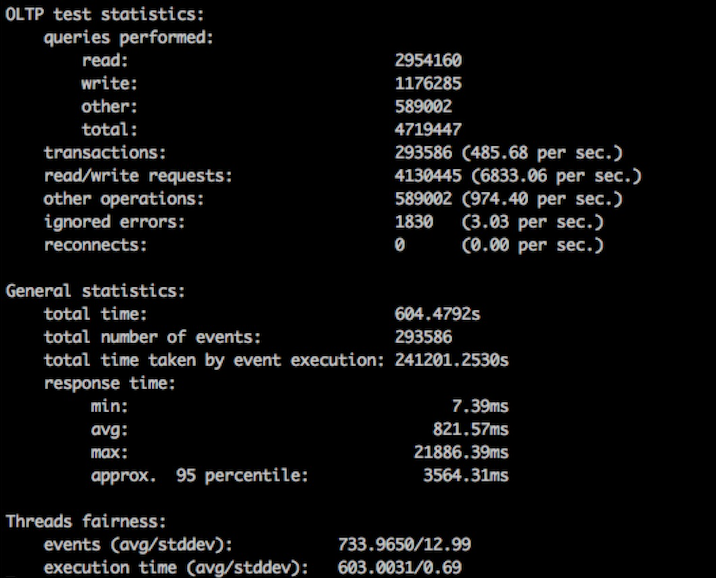
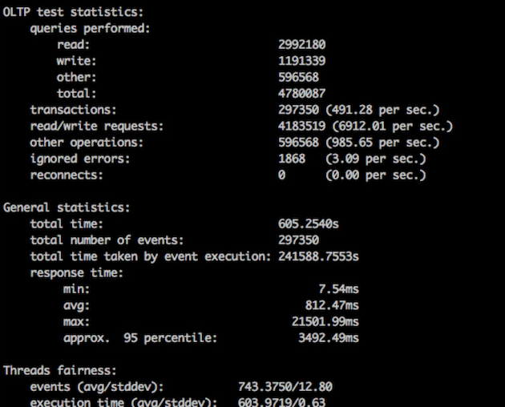
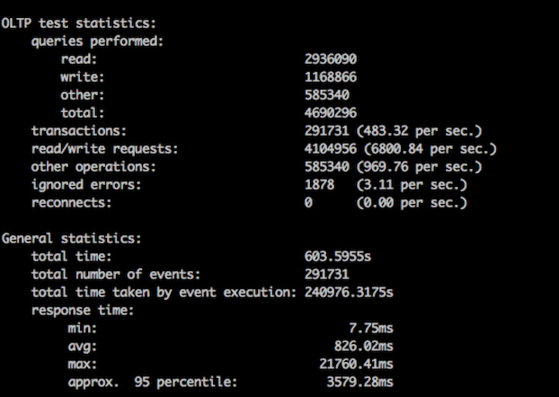
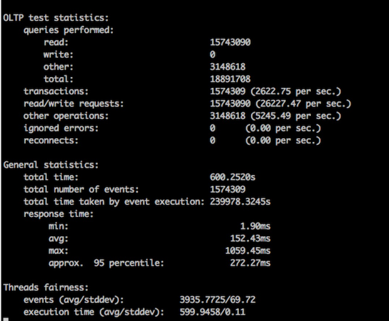
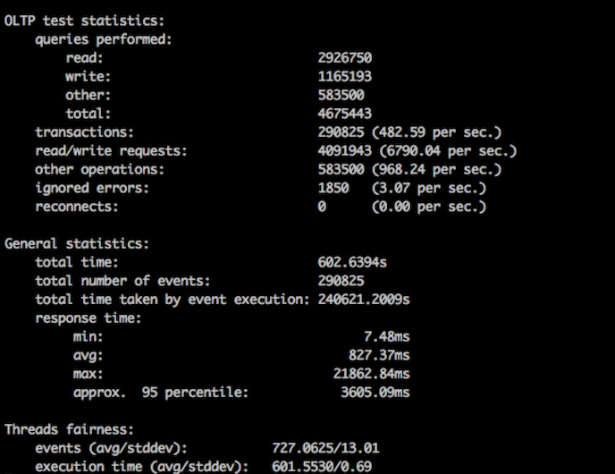

# RDS-Aurora 与 RDS-MySQL 性能对比实验

## 实验目的

使用 Sysbench 对 Aurora 与 MySQL 进行基准测试, 对比二者的读写性能.

本实验大约耗时**30分钟**, 实验区域为**俄勒冈**(您也可以根据实际情况自行更改)

## 涉及组件

- RDS - Aurora
- RDS - MySQL
- EC2

## 实验步骤

> **重要**
>
> 本实验默认您已经拥有了 AWS 账户并创建了 IAM 用户
>
> 若未执行以上设置，可参考[这里](https://docs.aws.amazon.com/zh_cn/AWSEC2/latest/UserGuide/get-set-up-for-amazon-ec2.html#sign-up-for-aws)

### 配置 VPC

新建 VPC 安全组，具体步骤参考[适用于 Amazon VPC 的 IPv4 入门](https://docs.aws.amazon.com/zh_cn/AmazonVPC/latest/UserGuide/getting-started-ipv4.html#getting-started-create-security-group)

将安全组的**入站规则**设置为

- **Type**: ALL Traffice
- **Protocol**: ALL
- **Port Range**: ALL
- **Source**: 选择 **Custom IP**，然后键入 `0.0.0.0/0`。

> **重要**
>
> 除演示之外，建议不要使用 0.0.0.0/0，因为它允许从 Internet 上的任何计算机进行访问。在实际环境中，您需要根据自己的网络设置创建入站规则。

### 配置 Aurora

1. 登录 AWS 管理控制台 并通过以下网址打开 Amazon RDS 控制台：<https://console.aws.amazon.com/rds/>。 

2. 在导航窗格中，选择**实例**。 

3. 选择**启动数据库实例**。**启动数据库实例向导**在**选择引擎**页面打开。

   

4. 选择 **Amazon Aurora**, 并将**版本**选择为**与 MySQL 5.7 兼容**，然后选择**下一步**。

5. 在**指定数据库详细信息**页面上，指定数据库实例信息。选择下列值，然后选择 **下一步**。

   - **数据库实例类**: **db.r4.4xlarge**
   - **多可用区部署**: **否**
   - **数据库实例标识符**: `aurora-vs-mysql`
   - **主用户名**: `masteruser`
   - **主密码**: 用户自定义

   

   

   在**配置高级设置**页面上，提供 RDS 启动 MySQL 数据库实例所需的其他信息。选择下列值，然后选择 **下一步**。

   - **Virtual Private Cloud (VPC)**：选择您在**配置 VPC**这一步骤中创建的安全组所对应的 VPC
   - **公开可用性**：是
   - **可用区**: `us-west-2a` (根据您的实际区域来更改, 但请保证之后的 MySQL 与 EC2 实例都在这一可用区中)
   - **VPC安全组**：选择现有 VPC 安全组，并且选择**配置 VPC**这一步骤中创建的安全组
   - **数据库集群标识符**: `aurora-vs-mysql-cluster`
   - **数据库名称**：键入`dbname`
   - **备份保留期**：1 天
   - **加密**: **禁用加密**
   - **备份保留期**: **1天**
   - **监控**: **禁用增强监控**
   - **其他请选择默认**

### 配置 MySQL

1. 登录 AWS 管理控制台 并通过以下网址打开 Amazon RDS 控制台：<https://console.aws.amazon.com/rds/>。 

2. 在导航窗格中，选择**实例**。 

3. 选择**启动数据库实例**。**启动数据库实例向导**在**选择引擎**页面打开。

4. 选择 **MySQL**，然后选择**下一步**。

5. **选择使用案例**页面询问您是否计划使用所创建的数据库实例进行生产。选择 **开发/测试**，然后选择 **下一步** 。  

6. 在**指定数据库详细信息**页面上，指定数据库实例信息。选择下列值，然后选择 **下一步**。 

   - **数据库引擎版本**: **MySQL 5.7.16** 
   - **数据库实例类**：**db.r4.4xlarge**
   - **存储类型**：**通用型( SSD)**
   - **分配的存储空间**：**20**GiB
   - **数据库实例标识符**：键入 `mysql-vs-aurora`。 
   - **主用户名**：键入 `masteruser`。 
   - **主密码**和**确认密码**：用户自定义
   - **其他设置保持默认**

   

   

7. 在**配置高级设置**页面上，提供 RDS 启动 MySQL 数据库实例所需的其他信息。选择下列值，然后选择 **下一步**。

   - **Virtual Private Cloud (VPC)**：选择您在**配置 VPC**这一步骤中创建的安全组所对应的 VPC
   - **公开可用性**：是
   - **可用区**: `us-west-2a`(务必与之前 Aurora 的可用区相同)
   - **VPC安全组**：选择现有 VPC 安全组，并且选择**配置 VPC**这一步骤中创建的安全组
   - **数据库名称**：键入`dbname`
   - **备份保留期**：1 天
   - **其他请选择默认**

### 配置 EC2

1. 启动实例

   - 打开 Amazon EC2 控制台 <https://console.aws.amazon.com/ec2/>。选择您要在其中创建EC2实例的区域。这里请保证与之前创建Aurora,MySQL 的区域相同。 
   - 从控制台控制面板中，选择 **启动实例**。
   - **Choose an Amazon Machine Image (AMI)** 页面显示一组称为 *Amazon 系统映像 (AMI)* 的基本配置，作为您的实例的模板。选择 Amazon Linux AMI 2 的 HVM 版本 AMI。 
   - 在**选择实例类型** 页面上，您可以选择实例的硬件配置。选择 `r4.8xlarge` 类型 
   - 在**配置实例详细信息**页面上
     - **实例的数量**: `5`
     - **网络**: 选择您再**配置 VPC** 中配置的安全组所在的 **VPC**
     - **子网**: 选择位与可用区`us-west-2a`的子网( 可能需要您来创建, 更多关于 VPC 的配置内容可查看[VPC 配置指南](vpc_guide.md) )
     - **自动分配公有 IP**: **启用**
     - **其他选择默认**

   

   - 在**添加存储**页面上, **大小(GiB)**输入`200` , 根目录卷类型选择**预置 IOPS SSD**, **IOPS**输入`10000`

   - 在**配置安全组**页面选择**选择一个现有的安全组**，并在表格中选择**配置 VPC**这一步骤中创建的安全组

   - 在**审核**页面选择**启动**

   - 当系统提示提供密钥时，选择 **选择现有的密钥对**，然后选择合适的密钥对。若没有创建密钥对，请参考[创建密钥对](https://docs.aws.amazon.com/zh_cn/AWSEC2/latest/UserGuide/get-set-up-for-amazon-ec2.html#create-a-key-pair)

     准备好后，选中确认复选框，然后选择 **启动实例**。  

2. 连接到 EC2, **您需要连接 5 台 EC2实例**

   请参考[使用 SSH 连接到 Linux 实例](https://docs.aws.amazon.com/zh_cn/AWSEC2/latest/UserGuide/AccessingInstancesLinux.html)

3. 在实例中安装 MySQL

   **在连接到 EC2 实例后( 5台实例 )**，依次输入以下命令，在实例中安装 Sysbench

   ```shell
   sudo yum -y install bzr
   sudo yum -y install automake
   sudo yum -y install libtool
   sudo yum -y install mysql-devel
   sudo bzr branch lp:sysbench
   cd sysbench
   sudo ./autogen.sh
   sudo ./configure
   sudo make
   cd sysbench
   ```

4. 输入以下命令, 使得 Linux 内核用来处理数据包的 CPU 数量由 2 改为全部, 并且减少内核间上下文的切换, 提高 EC2 实例的吞吐量**( 5台实例都需要 )**

   ```shell
   sudo sh -c 'for x in /sys/class/net/eth0/queues/rx-*; do echo ffffffff > $x/rps_cpus; done'
   sudo sh -c "echo 32768 > /proc/sys/net/core/rps_sock_flow_entries"
   sudo sh -c "echo 4096 > /sys/class/net/eth0/queues/rx-0/rps_flow_cnt"
   sudo sh -c "echo 4096 > /sys/class/net/eth0/queues/rx-1/rps_flow_cnt"
   ```

### 进行对比

在对比前, 您需要在 **RDS 控制台中**找到您 MySQL 与 Aurora 实例的终端节点, 类似下图


在测试命令中, 存在<your-mysql/aurora-endpoint> 与 *<your-mysql/aurora-password>* 的占位符, 您需要将其替换

- <your-mysql-endpoint> : 替换为您 **MySQL** 的**终端节点**
- <your-aurora-endpoint>: 替换为您 **Aurora** 的**终端节点**
- <your-mysql-password>: 替换为您在**配置 MySQL** 这一步中输入的用户**主密码**
- <your-aurora-password>: 替换为您在**配置 Aurora** 这一步中输入的用户**主密码**

#### 对 MySQL 进行压力测试

1. 准备数据

   **在任意一台 EC2 实例中**, 输入以下命令

   ```shell
   ./sysbench --test=tests/db/oltp.lua --mysql-host=<your-mysql-endpoint> --mysql-port=3306 --mysql-user=masteruser --mysql-password=<your-mysql-password> --mysql-db=dbname --mysql-table-engine=innodb --oltp-table-size=25000 --oltp-tables-count=250 --db-driver=mysql  prepare
   ```

2. 执行测试

   **同时在五台 EC2 实例中**, 输入以下命令

   ```shell
   ./sysbench --test=tests/db/oltp.lua --mysql-host=<your-mysql-endpoint> --oltp-tables-count=250 --mysql-user=masteruser --mysql-password=<your-mysql-password> --mysql-port=3306 --db-driver=mysql --oltp-table-size=25000 --mysql-db=dbname --max-requests=0 --oltp_simple_ranges=0 --oltp-distinct-ranges=0 --oltp-sum-ranges=0 --oltp-order-ranges=0 --max-time=600 --num-threads=400 run >> ~/logs/sysbench.log
   ```

#### 对 Aurroa 进行压力测试

1. 准备数据

   **在任意一台 EC2 实例中**, 输入以下命令

   ```shell
   ./sysbench --test=tests/db/oltp.lua --mysql-host=<your-aurora-endpoint> --mysql-port=3306 --mysql-user=masteruser --mysql-password=<your-aurora-password> --mysql-db=dbname --mysql-table-engine=innodb --oltp-table-size=25000 --oltp-tables-count=250 --db-driver=mysql  prepare
   ```

2. 执行测试

   **同时在五台 EC2 实例中**, 输入以下命令

   ```shell
   ./sysbench --test=tests/db/oltp.lua --mysql-host=<your-aurora-endpoint> --oltp-tables-count=250 --mysql-user=masteruser --mysql-password=<your-aurora-password> --mysql-port=3306 --db-driver=mysql --oltp-table-size=25000 --mysql-db=dbname --max-requests=0 --oltp_simple_ranges=0 --oltp-distinct-ranges=0 --oltp-sum-ranges=0 --oltp-order-ranges=0 --max-time=600 --num-threads=400 run >> ~/logs/sysbench.log
   ```

#### 查看实验结果

在 EC2 实例中, 输入以下命令, 即可查看**该 EC2 实例** 中的实验结果(MySQL 与 Aurora 的测试结果都在**同一文件中**), 若要获得准确结果, 请汇集**全部 5 台**实例的结果

```shell
sudo vim ~/logs/sysbench.log
```

## 对比结果

包含**五台 EC2 实例**中的结果

#### Aurora

1. 
2. 
3. 
4. 
5. 

#### MySQL

1. 
2. 
3. 
4. 
5. 